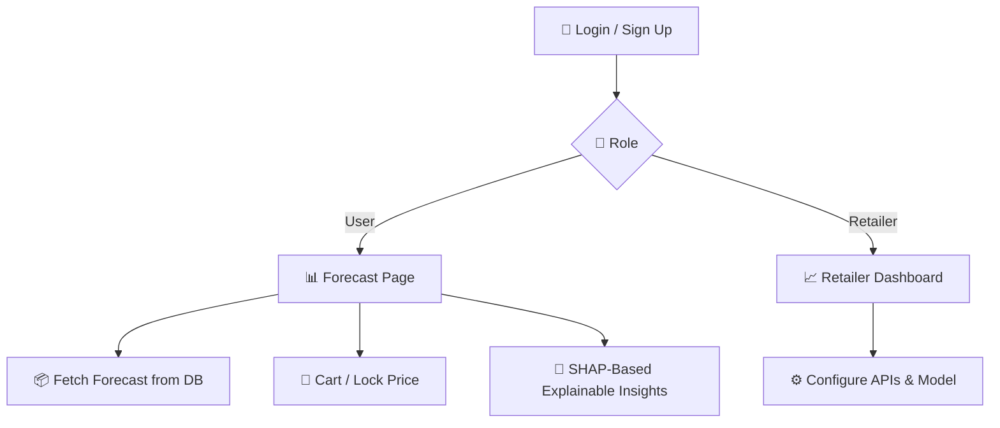

# 🧠 SmartRetail: Real-Time Dynamic Pricing & Forecasting System

> A retailer-focused AI platform for **10-day dynamic price forecasting**, **optimal buying recommendations**, and **explainable pricing insights** — with full role-based access, user personalization, and persistent cart + lock tracking.

---

## 🛒 Problem Statement

Retailers struggle to **price perishable or demand-sensitive products** dynamically across cities, seasons, and fluctuating stock. Traditional pricing doesn't factor in:

- Expiry timelines  
- Real-time weather or holiday events  
- Stock surplus or discount events  
- Demand volatility  
- Multi-user personalization  

Most systems either **hard-code rules** or rely on **overgeneralized ML models** with no explainability, poor forecasting, and no retailer control.

---

## ✅ Our Solution

We built **SmartRetail** — a real-time forecasting and decision support tool with:

- 📈 **10-day forecast** of optimal dynamic prices per product  
- 🔐 **Role-based login** for Retailers and Consumers (Users)  
- 🛍️ **Cart + Lock** functionality to preserve price deals  
- 🤖 **Explainable insights** (discount, expiry, demand, holidays)  
- 🌦️ **Weather & holiday-aware pricing** (via API integrations)  
- 🧠 Powered by AI with SQLite + Streamlit + ML model backend  

All interactions persist across logins, per user, with zero guesswork.

---

## 🚀 Features

| Role       | Feature Description                                                                 |
|------------|-------------------------------------------------------------------------------------|
| 👤 Users   | View price forecasts, add to cart, lock deals, get best-buy suggestions             |
| 🧑‍💼 Retailers | Manage pricing models, integrate APIs (weather/holiday), monitor volatility        |
| 🔐 Secure   | Login/signup with role-based access using SQLite                                     |
| 📦 Forecast | 10-day price prediction with CI, volatility band, and SHAP-like insight              |
| 🔄 Persistent | Cart & lock state saved across sessions per user                                   |
| ☁️ Cloud-ready | Uses `secrets.toml` for API keys and Streamlit Cloud deployment support          |

---

## 🧰 Tech Stack

- **Frontend/UI**: Streamlit 1.45  
- **Database**: SQLite (`users.db`, `retail_forecasts.db`)  
- **ML/Forecasting**: `model.pkl` (SARIMAX or custom pricing logic)  
- **External APIs**: Weather, Holiday data via `secrets.toml`  
- **Environment**: Python 3.11.9  
- **Libraries**: Pandas, NumPy, Matplotlib, Altair, LangChain, gspread  

---

## 🛠️ Setup Instructions

Follow these steps to run the app locally:

## 1. Clone the Repository

```bash
git clone https://github.com/your-username/smart-retail
cd smart-retail
```

## 2. Create and Activate a Conda Environment

```bash
conda create -n tf_env python=3.11.9
conda activate tf_env
```

## 3. Install Required Packages

```bash
pip install -r requirements.txt
```

## 4. Add Your API Keys

```bash
[api_keys]
weather = "your-weather-api-key"
holiday = "your-holiday-api-key"
```

## 5. Run the App

```bash
streamlit run Auth.py
```

---

## Project Structure 
```text
.
├── .env                      # Environment variables (usually ignored by Git)
├── .gitignore                # Git ignored files and folders
├── Auth.py                   # Authentication logic
├── E1.ipynb                  # Jupyter Notebook (probably for exploration or prototyping)
├── model.pkl                 # Trained machine learning model (pickle file)
├── README.md                 # Project documentation
├── requirements.txt          # Python dependencies for the project
├── retail_forecasts.db       # Retail forecast SQLite database
├── runtime.txt               # Specifies Python runtime version for deployment
├── users.db                  # User data in SQLite format
├── pages/                    # Streamlit multi-page app folder
│   ├── Retailer.py           # Retailer dashboard logic
│   └── User.py               # User dashboard or view logic
```

---


## 🔄 System Data Flow


---


## 🌟 Benefits

- 📉 **Reduces Pricing Inefficiencies and Inventory Loss**  
  Forecasts demand-sensitive prices and expiry-aware markdowns to reduce waste.

- 🧠 **Empowers Users to Lock In Best Pricing Windows**  
  Allows consumers or retailers to lock predicted low prices for optimal procurement.

- 🔍 **Transparent Pricing Decisions via AI Insights**  
  Integrated SHAP explainability exposes top features influencing pricing forecasts.

- 🔐 **Secure, Persistent Multi-User Environment**  
  Role-based authentication with user-specific session and lock state (SQLite/MySQL).

- 💡 **Retailer-Centric Pricing Control**  
  Tailored forecasts and analytics per product, category, and location.

- ☁️ **Cloud-Deployable & API-Driven**  
  Designed for Streamlit Cloud deployment or backend integration via REST API.

---

## 🔮 Future Enhancements

- 📲 **WhatsApp Alerts for Locked Price Drops**  
  Notify users when a previously locked-in item drops in price.

- 📊 **Retail Analytics Dashboard**  
  Includes:
  - Inventory heatmaps (stock vs expiry)
  - Markdown timelines
  - Projected revenue uplift charts

- 🛒 **Buy-Now Triggers**  
  Trigger price actions based on real-time stock decay and expiry thresholds.

- ☁️ **Streamlit Cloud Deploy with Seeding**  
  Preloaded demo data (products, pricing history) at deploy-time.

- 🔁 **Scheduled Forecast Refresh**  
  CRON-based prediction refresh every 12 hours (via APScheduler or system CRON).

---
